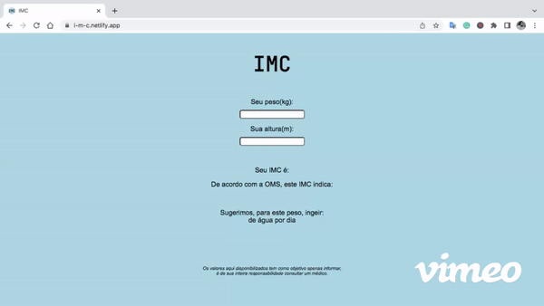

# projeto-imc 

## Objetivo:
Conscientização de saúde ao facilitar o acesso à informação do IMC e necessidade de consumo diário de água.
 
## Utilização:
Para utilizar a aplicação, basta informar seu peso(kg) e sua altura(m), as informações de IMC, Faixa de IMC e Sugestão de consumo diário de água aparecerão automaticamente.

### Acesse e utilize a aplicação: https://i-m-c.netlify.app/

## Considerações:
Importante ressaltar que os valores informados tem por base os parâmetros fornecidos pela OMS, porém, os resultados possuem apenas caráter informativo. 
Somente um médico pode diagnosticar doenças, indicar tratamentos e receitar remédios.
